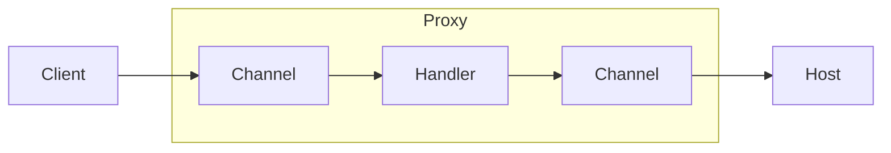
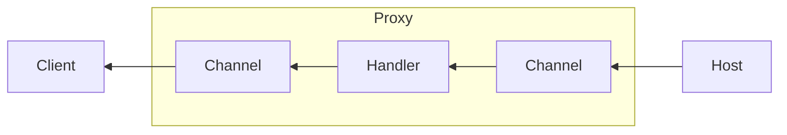

# Channels Proxy

A simple TCP proxy built on top of Channels.




Incoming connections are tracked and a new connection is created to the target host; the latter is linked to the former by setting the source channel identifier in the target channel metadata.

- When the source channel is closed, the target channel is closed as well.
- When the target channel is closed, the source channel is closed as well.
- The target channel is only created when data is received from the source channel.

## Publish single file binary

Replace `linux-x64` with the desired target platform and architecture. For example, Windows x64 is `win-x64` and macOS (Sierra+) x64 is `osx-x64`.

```bash
dotnet publish -r linux-x64 -p:PublishSingleFile=true --self-contained true -o dist/linux-x64 src
```
